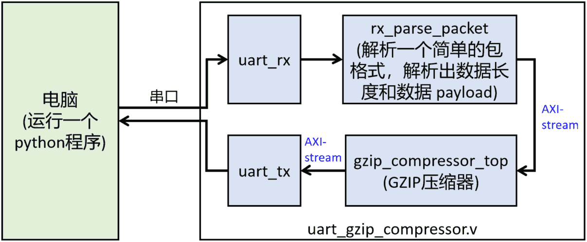

-9A90FD.svg)   

[English](#en) | [中文](#cn)

　

<span id="en">FPGA GZIP compressor</span>
===========================

An FPGA-based streaming GZIP (deflate) compressor supports both LZ77 and dynamic huffman. For universal lossless data compression. Input raw data and output the standard GZIP format (as known as .gz / .tar.gz file format).

　


　

## Features

* **Pure RTL design** which is universal for all FPGA platforms.
* **Simple streaming input/output interface** ：
  * AXI-stream input interface:
    * 8-bit data width, each cycle can input 1B (byte).
    * Each input AXI-stream packet with length ≥32B will be compressed into an independent GZIP data stream.
    * Input AXI-stream packet with length <32B will be discarded internally, since not worthy for compression.

  * AXI-stream output interface:
    * 32-bit data width.
    * Each output AXI-stream packet is a GZIP data stream (including header/footer).
* **Performance**：
  * If there is no back pressure at the output interface, i.e. `o_tready=1` always, then the input interface will also have no back pressure, i.e. `o_tready=1` always (even in the worst case).
    * This is a deliberate design. The advantage is that when the external bandwidth is sufficient, this module can run at a certain and highest performance (input throughput=clock frequency)
  * Clock frequency reaches 128 MHz on Xilinx Artix-7 xc7a35ticsg324-1L. i.e., input performance = 128MB/s
* **Resource Usage**：8.2k LUT and 25 BRAM36K on Xilinx FPGA. 
* Support **almost complete deflate algorithm**:
  * Complies with deflate algorithm specification (RFC1951 [1]) and GZIP format specification (RFC1952 [2]).
  * deflate block :
    * Input AXI-stream packets ≤16384B are treated as one deflate block
    * Input AXI-stream packets >16384B are splitted to multiple deflate block
  * **LZ77 Compression**:
    * Maximum search distance is 16383, which covers the entire deflate block.
    * Use hash table for matching, hash table size = 4096.

  * **Dynamic huffman coding**：
    * Build dynamic huffman tree for large deflate blocks, including literal code tree and distance code tree.
    * Use static huffman tree for small deflate blocks.
  * The compression ratio of this design:
    * is close to .gz files generated by 7ZIP software under the "fast compression" option.
    * is significantly better than other open-sourced hardware deflate compressors, since it supports dynamic huffman.
  * According to GZIP spec, calculates CRC32 of raw data and places it at GZIP footer.
* Unsupported algorithm features：
  * Do not build dynamic code length tree , but use a fixed one. Because its benefits/costs are not as high as dynamic literal code trees and distance code trees.
  * Do not support deflate block >16384B. The goal is to save BRAM resources.
  * In LZ77, larger hash tables and multi-level hash tables are not supported. The goal is to save BRAM resources.
  * Do not dynamically adjust the size of deflate block to improve compression rate. The goal is to reduce complexity.
  * The above factors are the reason why the compression ratio is lower than software-based GZIP compression.


　

　

# Module Usage

The design source code is in RTL directory. In which [**gzip_compressor_top.v**](./RTL/gzip_compressor_top.v) is the top module.

## Module in/out signals

The in/out signals of gzip_compressor_top is as follows:

```verilog
module gzip_compressor_top # (
    parameter          SIMULATION = 0     // 0:disable simulation assert (for normal use)  1: enable simulation assert (for simulation)
) (
    input  wire        rstn,              // asynchronous reset.   0:reset   1:normally use
    input  wire        clk,
    // input  stream : AXI-stream slave,  1 byte width (thus do not need tkeep and tstrb)
    output wire        i_tready,
    input  wire        i_tvalid,
    input  wire [ 7:0] i_tdata,
    input  wire        i_tlast,
    // output stream : AXI-stream master, 4 byte width
    input  wire        o_tready,
    output reg         o_tvalid,
    output reg  [31:0] o_tdata,
    output reg         o_tlast,
    output reg  [ 3:0] o_tkeep            // At the end of packet (tlast=1), tkeep may be 4'b0001, 4'b0011, 4'b0111, or 4'b1111. In other cases, tkeep can only be 4'b1111
);
```

　

## Reset

- reset when `rstn=0`
- On most FPGAs, it can actually work without resetting. On some FPGAs that do not support `initial` register, it is necessary to reset before use.

　

## Input AXI-stream

The input interface is a standard 8-bit wide AXI-stream slave.

- `i_tvalid` handshakes with `i_tready` . Successfully input 1 data only when `i_tvalid=1` and `i_tready=1` simultaneously (see following figure).
- `i_tdata` is one-byte input data.
- `i_tlast` is the boundary mark of the package, ` i_tlast=1 ` means that the current byte is the last byte of a packet, and the next transmitted byte is the first byte of the next packet. Each packet is compressed into an independent GZIP data stream.

```
              _    __    __    __    __    __    __    __    __    __    __    __
     clk       \__/  \__/  \__/  \__/  \__/  \__/  \__/  \__/  \__/  \__/  \__/  \
                          _____________________________             _____
    tvalid    ___________/                             \___________/     \________
              _________________                   ________________________________
    tready                     \_________________/
                          _____ _______________________             _____
    tdata     XXXXXXXXXXXX__D1_X___________D2__________XXXXXXXXXXXXX__D3_XXXXXXXXX  
```

　

## Output AXI-stream

The output interface is a standard 32 bit (4byte) wide AXI-stream master.

- `o_tvalid` handshakes with `o_tready` . Successfully input one data only when `i_tvalid=1` and `i_tready=1` simultaneously (as same as input AXI-stream).
- `o_tdata` is 4-byte output data. According to AXI-stream spec, `o_tdata` is small endian, i.e. `o_tdata[7:0]` is the earliest byte, `o_tdata[31:24]` is the latest byte.
- `o_tlast` is the boundary mark of the package. Each packet an GZIP data stream.
- `o_tkeep` is byte-valid signal :
  - `o_tkeep[0]=1` means `o_tdata[7:0]` exist,
  - `o_tkeep[1]=1` means `o_tdata[15:8]` exist,
  - `o_tkeep[2]=1` means `o_tdata[23:16]` exist,
  - `o_tkeep[3]=1` means `o_tdata[31:24]` exist.
- When the byte number of the output packet is not an integer multiple of 4, at the end of the packet (when `o_tlast=1`), `o_tkeep` be `4'b0001`, `4'b0011`, or `4'b0111`
- Otherwise, `o_tkeep=4’b1111` always.

　

## Output format

The output data of AXI-stream satisfies GZIP format standard. After storing each AXI-stream packet in an .gz file, this file can be decompressed by compression softwares (7ZIP, WinRAR, etc.).

> Tip: .gz is GZIP compressed files. More well-known files are .tar.gz. In fact, TAR packages multiple files into a single .tar file, and then compresses this .tar file to obtain a .tar.gz file. If a single file is compressed, it can be directly compressed into a .gz without TAR packaging. For example, compress data.txt to data.txt.gz

For example, a total of 987 handshakes were performed on the output AXI-stream interface, and the last handshake was `o_tlast=1` , indicating that the 987 cycles of data are an independent GZIP stream. Assuming the last handshake ` o_tkeep=4'b0001 `, then the last cycle only carries 1 byte of data, thus the GZIP stream contains a total of 986×4+1=3949 bytes. If you save these bytes into a. gz file, it should be:

```
.gz file 1st byte = o_tdata[7:0] of 1st cycle
.gz file 2nd byte = o_tdata[15:8] of 1st cycle
.gz file 3rd byte = o_tdata[23:16] of 1st cycle
.gz file 4th byte = o_tdata[31:24] of 1st cycle
.gz file 5th byte = o_tdata[7:0] of 2nd cycle
.gz file 6th byte = o_tdata[15:8] of 2nd cycle
.gz file 7th byte = o_tdata[23:16] of 2nd cycle
.gz file 8th byte = o_tdata[31:24] of 2nd cycle
......
.gz file 3945th byte = o_tdata[7:0] of 986th cycle
.gz file 3946th byte = o_tdata[15:8] of 986th cycle
.gz file 3947th byte = o_tdata[23:16] of 986th cycle
.gz file 3948th byte = o_tdata[31:24] of 986th cycle
.gz file 3949th byte = o_tdata[7:0] of 987th cycle
```

　

## Other considerations

- If there is no back pressure at the output interface, i.e. `o_tready=1` always, then the input interface will also have no back pressure, i.e. `o_tready=1` always (even in the worst case).
  - With this feature, if the external bandwidth is sufficient to always ensure `o_tready=1` , then we can ignore `i_tready` . The module can runs in the stable maximum performance.
- The deflate algorithm requires the entire deflate block to construct a dynamic huffman tree, so the end-to-end latency of this module is high:
  - When the input AXI-stream packet is 32\~16384B, the first data of the corresponding compressed packet can only be obtained on the output AXI-stream interface after the complete packet has been input (and after some time has passed).
  - When the input AXI-stream packet is >16384B, each time when we input 16384 bytes completely, we can get the corresponding compressed data related to them.
- When the input AXI-stream packet is <32B, the module will discard it internally and will not generate any output data for it.
- To achieve a high compression ratio, try to keep the packet length>7000 bytes, otherwise the module may not choose to use dynamic huffman, and the search range of LZ77 will also be limited. If the data that needs to be compressed logically consists of many very small AXI-stream packets, a preprocessor can be added to merge them into a large packet.

　

　

# Evaluation

### Comparison objects

To evaluate the comprehensive performance of this design, I compare it with the following three deflate compression schemes:

- [Software Compression]()：Run [7ZIP](https://7-zip.org/) software on computer
  - Config : Format=gzip, Compression Level=Fast, Algorithm=Deflate, Dictionary Size=32KB, Word Size=32
- [HDL-deflate](https://github.com/tomtor/HDL-deflate) ：An FPGA-based deflate compressor/decompressor
  - Its compressor supports LZ77+static huffman, but without dynamic huffman 。In LZ77, it does not use a hash table for searching.
  - Config : In this test, we use its the highest configuration (also the default configuration) : `LOWLUT=False`, `COMPRESS=True` , `DECOMPRESS=False` , `MATCH10=True` ,`FAST=True` 
- [HT-Deflate-FPGA](https://github.com/UCLA-VAST/HT-Deflate-FPGA) ：An FPGA-based multi-core deflate compressor/decompressor
  - It also only uses LZ77+static huffman, but without dynamic huffman. In LZ77, it uses hash tables, which is the same as my design.
  - It is a multi-core parallel deflate compressor on Xilinx AWS cloud FPGA, which has extremely high performance but uses many resources. In contrast, both [HDL-deflate](https://github.com/tomtor/HDL-deflate) and my design are single-core compressor designed for embedded applications.
  - This design does not provide hands-on simulation project, making it difficult to quickly run. Therefore, it is not included in actual testing here, only qualitative comparison is conducted.

### Comparison platforms

- Software compression runs on my personal computer (Intel Core i7-12700H, 16GB DDR4).
- Both [HDL-deflate](https://github.com/tomtor/HDL-deflate) and my design deploy on Artix-7  [Arty Board](https://china.xilinx.com/products/boards-and-kits/arty.html) .

### Benchmark

The data to be compressed for comparison is [input.hex]() located in [Arty-example/python](./Arty-example/python) directory, with a size of 1MB.

### Result

The following table shows the comparison results. Note that ↑ represents the larger the better, ↓ represents the smaller the better.

|          indicators          |    [Software]()    |   [My design]()    | [HDL-deflate](https://github.com/tomtor/HDL-deflate) | [HT-Deflate-FPGA](https://github.com/UCLA-VAST/HT-Deflate-FPGA) |
| :--------------------------: | :----------------: | :----------------: | :--------------------------------------------------: | :----------------------------------------------------------: |
|            LZ77 ?            | :heavy_check_mark: | :heavy_check_mark: |                  :heavy_check_mark:                  |                      :heavy_check_mark:                      |
|      hash search LZ77 ?      | :heavy_check_mark: | :heavy_check_mark: |                         :x:                          |                      :heavy_check_mark:                      |
| dynamic literal code tree ?  | :heavy_check_mark: | :heavy_check_mark: |                         :x:                          |                             :x:                              |
| dynamic distance code tree ? | :heavy_check_mark: | :heavy_check_mark: |                         :x:                          |                             :x:                              |
|  dynamic length code tree ?  | :heavy_check_mark: |        :x:         |                         :x:                          |                             :x:                              |
| dynamic adjust block size ?  | :heavy_check_mark: |        :x:         |                         :x:                          |                             :x:                              |
| **FPGA logic resource** (↓)  |         -          |      8200×LUT      |                       2854×LUT                       |                           ? (huge)                           |
| **FPGA memory resource** (↓) |         -          |     25×BRAM36K     |                     8.5×BRAM36K                      |                           ? (huge)                           |
|     Clock frequency (↑)      |         -          |      128 MHz       |                        95 MHz                        |                              ?                               |
|   Clock cycle consumed (↓)   |         -          |      1000000       |                       3089170                        |                              ?                               |
|    Input Bytes/cycle (↑)     |         -          |        1.0         |                        0.324                         |                              ?                               |
| **Overall Performance** (↑)  |       44MB/s       |    **128MB/s**     |                       31 MB/s                        |                        10 GB/s level                         |
|          Power (↓)           |        High        |        Low         |                         Low                          |                             High                             |
|     Compressed size (↓)      |       680 kB       |       780 kB       |                        927 kB                        |                              ?                               |
|  **Compression ratio** (↑)   |        32%         |        22%         |                         7.3%                         |                     between 7.3% & 22% *                     |

> \* The compression ratio of [HT-Deflate-FPGA](https://github.com/UCLA-VAST/HT-Deflate-FPGA) may larger than [HDL-deflate](https://github.com/tomtor/HDL-deflate) , but smaller than my design. This conclusion is analyzed based on the algorithm characteristics it supports.

　

　

# Deployment result

The implement result of gzip_compressor_top on multiple FPGAs:

|   FPGA series   |      FPGA part      |  logic   | logic (%) | on-chip-mem | on-chip-mem (%) | frequency |
| :-------------: | :-----------------: | :------: | :-------: | :---------: | :-------------: | :-------: |
| Xilinx Artix-7  |  xc7a35ticsg324-1L  | 8218*LUT |    40%    | 25*BRAM36K  |       50%       |  128 MHz  |
|  Xilinx Zynq-7  |   xc7z020clg484-1   | 8218*LUT |    16%    | 25*BRAM36K  |       18%       |  128 MHz  |
| Xilinx Virtex-7 | xc7vx485tffg1761-1  | 8201*LUT |    3%     | 25*BRAM36K  |       3%        |  160 MHz  |
|   Xilinx ZU+    | xczu3eg-sbva484-2-e | 8180*LUT |    12%    | 24*BRAM36K  |       11%       |  280 MHz  |
| Altera Cyclone4 |    EP4CE55F23C8     | 16807*LE |    30%    | 807398 bits |       34%       |  74 MHz   |

　

　

# Simulation

The simulation source code is in SIM directory. In which [**tb_gzip_compressor.v**](./SIM/tb_gzip_compressor.v) is the top module.

The diagram of this testbench is as follows:


　

Among them, the random data packet generator (tb_random_data_source.v) will generate four types of data packets with different characteristics (random bytes with uniform distribution, random bytes with non-uniform distribution, randomly continuously changing data, and sparse data), which will be sent to the design under test (gzip_compressor_top) for compression, and then tb_save_result_to_file.v module will store the compressed results into files. Each packet is stored into a independent .gz file.

tb_print_crc32 is responsible for calculating the CRC32 of the raw data and printing it. Note that the CRC32 is also calculated internally in gzip_compressor_top and filled into the footer. These two CRC32 calculators are independent (the former is only used for simulation to verify whether the CRC32 generated by the module under test is correct). You can compare the simulated printed CRC32 with the CRC32 in the GZIP file on your own.

　

## Simulate using iverilog

You can follow the following steps to simulate using iverilog:

* Install iverilog, see [iverilog_usage](https://github.com/WangXuan95/WangXuan95/blob/main/iverilog_usage/iverilog_usage.md) 
* In Windows, double click tb_gzip_compressor_run_iverilog.bat to run simulation. Where tb_gzip_compressor_run_iverilog.bat contains the simulation compilation and running commands.
* When simulation, the random packet generator will generate 10 packets by default, the simulation usually takes about ten minutes to complete. You can modify the macro `FILE_COUNT` in tb_random_data_source.v.  
* The GZIP compressed stream generated by simulation will be stored in sim_data directory. (you can modify it by modifying macro `OUT_FILE_PATH` in tb_save_result_to_file.v)
  * You can use compression software such as 7ZIP and WinRAR to extract these .gz files.
* To batch check the files generated by simulation for formatting errors, you can run a Python source fin sim_data directory. You need to open a command line in sim_data directory, and run command:

```powershell
python check_gz_file.py .
```

The command means: check all .gz files in current directory (`.` ), i.e. sim_data.

## Simulate using other simulators

In addition to iverilog, you can use other simulators. Just add all the .v files in RTL and SIM directories to the simulation project, and set tb_gzip_compressor.v to be the top-level file for simulation.

　

　

# FPGA demo

I provided an demo which runs on [Arty development board](https://china.xilinx.com/products/boards-and-kits/arty.html) (this demo is also a pure RTL design, which can be ported to other FPGAs).

The FPGA project receives UART (serial port) data, feeds it into the GZIP compressor, and sends the resulting GZIP stream through the serial port (UART: baud rate 115200, no parity).

On the computer, we run a Python program. The execution steps of the program are:

- Read a file from the computer's disk (user specifies the file name through the command line);
- List all serial ports on the computer. The user needs to select the one corresponds to FPGA (if only one serial port is found, select it directly);
- Send all bytes of the file to FPGA through the serial port;
- Simultaneously receiving data from FPGA;
- Storing the received data into a .gz file;
- Finally, call Python's gzip library to extract the .gz file and compare it with the original data to see if it is equal. If not equal, report an error.

> The serial port speed is much lower than the maximum performance that gzip_compressor_top can achieve, so this project is only used for demonstration. To achieve higher performance of the module, another high-speed communication interfaces need to be used.

The following figure is the block diagram of this demo.


　

Files related to the project:

- Arty-example/RTL includes FPGA sources (except gzip_compressor_top, it is in ./RTL directory)
- Arty-example/vivado is the vivado project
- Arty-example/python includes python program (`fpga_uart_gz_file.py`)

After programming the FPGA, open a command line in Arty_example/python directory and run the following command:

```powershell
python fpga_uart_gz_file.py <file_name_to_compress>
```

For example, running the following command to compress raw.hex :

```powershell
python fpga_uart_gz_file.py raw.hex
```

If the compression is successful, we can get `raw.hex`  without any errors.

　

　

　

<span id="cn">FPGA GZIP compressor</span>
===========================

基于 **FPGA** 的流式的 **GZIP** (deflate 算法) 压缩器。用于**通用无损数据压缩**：输入原始数据，输出标准的 GZIP 格式，即常见的 .gz / .tar.gz 文件的格式。

　


　

## 特性

* **纯 RTL 设计**，在各种 FPGA 型号上都可以部署。
* **极简流式接口** ：
  * AXI-stream 输入接口
    * 数据位宽 8-bit ，每周期可输入 1 字节的待压缩数据
    * 输入的长度 ≥32 字节的 AXI-stream 包 (packet) 会被压缩为一个独立的 GZIP 数据流
    * 输入的长度 <32 字节的 AXI-stream 包会被模块丢弃 (不值得压缩) ，不会产生任何输出

  * AXI-stream 输出接口
    * 数据位宽 32-bit
    * 每个输出的 AXI-stream 包是一个独立的 GZIP 数据流 (包括GZIP文件头和文件尾)
* **性能**：
  * 如果输出接口无反压，也即 o_tready 始终=1，则输入接口也一定无反压，也即 o_tready 始终=1 (即使在最坏情况下) 。
    * 这是我刻意设计的，好处是当外部带宽充足时，本模块可跑在确定且最高的性能下 (输入吞吐率=时钟频率)
  * 在 Xilinx Artix-7 xc7a35ticsg324-1L 上时钟频率跑到 128MHz (输入性能为 128MByte/s)
* **资源**：在 Xilinx FPGA 上约占 8200 LUT 和 25 个 BRAM36K 
* 支持**几乎完整的 deflate 算法** ：
  * 依照 deflate 算法规范 (RFC1951 [1]) 和 GZIP 格式规范 (RFC1952 [2]) 编写
  * deflate block :
    * 小于 16384 字节的输入 AXI-stream 包当作一个 deflate block
    * 大于 16384 字节的输入 AXI-stream 包分为多个 deflate block , 每个不超过 16384
  * **LZ77 游程压缩**:
    * 搜索距离为 16383 , 范围覆盖整个 deflate block
    * 使用哈希表匹配搜索，哈希表大小=4096

  * **动态 huffman 编码**：
    * 当 deflate block 较大时，建立动态 huffman tree ，包括 literal code tree 和 distance code tree
    * 当 deflate block 较小时，使用静态 huffman tree 进行编码
  * 由于支持了以上功能，本设计的压缩率：
    * 接近 7ZIP 软件在“快速压缩”选项下生成的 .gz 文件。
    * 显著大于其它现有的开源 deflate 压缩器，因为本设计支持动态 huffman。
  * 依照 GZIP 的规定，生成原始数据的 CRC32 放在 GZIP 的末尾，用于校验。
* 不支持的特性：
  * 不构建动态 code length tree , 而是使用固定 code length tree ，因为它的收益代价比不像动态 literal code tree 和 distance code tree 那么高。
  * 不支持大于 16384 的 deflate block ，目的是降低 BRAM 资源。
  * LZ77压缩时，不支持更大的哈希表和多级哈希表，目的是降低 BRAM 资源。
  * 不会为了提高压缩率而动态调整 deflate block 大小，目的是降低复杂度。
  * 以上因素是本设计的压缩率低于基于软件的 GZIP 压缩的原因。


　

　

# 使用方法

RTL 目录包含了 GZIP 压缩器的设计源码，其中的 [**gzip_compressor_top.v**](./RTL/gzip_compressor_top.v) 是 IP 的顶层模块。

## 模块信号

gzip_compressor_top 的输入输出信号如下

```verilog
module gzip_compressor_top # (
    parameter          SIMULATION = 0     // 0:disable simulation assert (for normal use)  1: enable simulation assert (for simulation)
) (
    input  wire        rstn,              // asynchronous reset.   0:reset   1:normally use
    input  wire        clk,
    // input  stream : AXI-stream slave,  1 byte width (thus do not need tkeep and tstrb)
    output wire        i_tready,
    input  wire        i_tvalid,
    input  wire [ 7:0] i_tdata,
    input  wire        i_tlast,
    // output stream : AXI-stream master, 4 byte width
    input  wire        o_tready,
    output reg         o_tvalid,
    output reg  [31:0] o_tdata,
    output reg         o_tlast,
    output reg  [ 3:0] o_tkeep            // At the end of packet (tlast=1), tkeep may be 4'b0001, 4'b0011, 4'b0111, or 4'b1111. In other cases, tkeep can only be 4'b1111
);
```

　

## 复位

- 令 rstn=0 可复位，之后正常工作时都保持 rstn=1。
- 在大多数 FPGA 上其实可以不用复位就能工作。在少数不支持 `initial` 寄存器初始化的 FPGA 上，使用前必须复位。

　

## 输入接口

输入接口是标准的 8-bit 位宽的 AXI-stream slave

- `i_tvalid` 和 `i_tready` 构成握手信号，只有同时=1时才成功输入了1个数据 (如下图)。
- `i_tdata` 是1字节的输入数据。
- `i_tlast` 是包 (packet) 的分界标志，`i_tlast=1` 意味着当前传输的是一个包的末尾字节，而下一个传输的字节就是下一包的首字节。每个包会被压缩为一个独立的 GZIP 数据流。

```
              _    __    __    __    __    __    __    __    __    __    __    __
     clk       \__/  \__/  \__/  \__/  \__/  \__/  \__/  \__/  \__/  \__/  \__/  \
                          _____________________________             _____
    tvalid    ___________/                             \___________/     \________
              _________________                   ________________________________
    tready                     \_________________/
                          _____ _______________________             _____
    tdata     XXXXXXXXXXXX__D1_X___________D2__________XXXXXXXXXXXXX__D3_XXXXXXXXX  
```

　

## 输出接口

输出接口是标准的 32-bit (4字节) 位宽的 AXI-stream master

- `o_tvalid` 和 `o_tready` 构成握手信号，只有同时=1时才成功输出了1个数据 (类似输入接口) 。
- `o_tdata` 是4字节的输出数据。按照 AXI-stream 的规定，`o_tdata` 是小端序，`o_tdata[7:0]` 是最靠前的字节，`o_data[31:24]` 是最靠后的字节。
- `o_tlast` 是包的分界标志。每个包是一个独立的 GZIP 数据流。
- `o_tkeep` 是字节有效信号：
  - `o_tkeep[0]=1` 意为 `o_tdata[7:0]` 有效，否则无效
  - `o_tkeep[1]=1` 意为 `o_tdata[15:8]` 有效，否则无效
  - `o_tkeep[2]=1` 意为 `o_tdata[23:16]` 有效，否则无效
  - `o_tkeep[3]=1` 意为 `o_tdata[31:24]` 有效，否则无效
- 当输出包的字节数量不能整除4时，只有在包的末尾 (`o_tlast=1` 时) ，`o_tkeep` 才可能为 `4'b0001, 4'b0011, 4'b0111` 
- 其余情况下 `o_tkeep=4’b1111`

　

## 输出格式

AXI-stream 接口输出的是满足 GZIP 格式标准的数据，将每个 AXI-stream 包的数据独立存入一个 .gz 文件后，这个文件就可以被众多压缩软件 (7ZIP, WinRAR 等) 解压。

> 提示： .gz 是 GZIP 压缩文件的概念。更为人熟知的是 .tar.gz 。实际上 TAR 是把多个文件打包成一个 .tar 文件，然后再对这一个 .tar 文件进行 GZIP 压缩得到 .tar.gz 文件。如果对单个文件进行压缩，则可以不用 TAR 打包，直接压缩为一个 .gz 。例如 data.txt 压缩为 data.txt.gz

例如，AXI-stream 接口上一共成功握手了 987 次，最后一次握手时 `o_tlast=1` ，说明这 987 拍数据是一个独立的 GZIP 流。假设最后一次握手时 `o_tkeep=4'b0001` ，则最后一拍只携带1字节的数据，则该 GZIP 流一共包含 986×4+1=3949 字节。如果将这些字节存入 .gz 文件，则应该：

```
.gz 文件的第1字节 对应 第1拍的 o_tdata[7:0]
.gz 文件的第2字节 对应 第1拍的 o_tdata[15:8]
.gz 文件的第3字节 对应 第1拍的 o_tdata[23:16]
.gz 文件的第4字节 对应 第1拍的 o_tdata[31:24]
.gz 文件的第5字节 对应 第2拍的 o_tdata[7:0]
.gz 文件的第6字节 对应 第2拍的 o_tdata[15:8]
.gz 文件的第7字节 对应 第2拍的 o_tdata[23:16]
.gz 文件的第8字节 对应 第2拍的 o_tdata[31:24]
......
.gz 文件的第3945字节 对应 第986拍的 o_tdata[7:0]
.gz 文件的第3946字节 对应 第986拍的 o_tdata[15:8]
.gz 文件的第3947字节 对应 第986拍的 o_tdata[23:16]
.gz 文件的第3948字节 对应 第986拍的 o_tdata[31:24]
.gz 文件的第3949字节 对应 第987拍的 o_tdata[7:0]
```

　

## 其它注意事项

- 如果输出接口无反压，也即 `o_tready` 始终=1，则输入接口也一定无反压，也即 `o_tready` 始终=1 (即使在最坏情况下) 。
  - 借助这个特性，如果外部带宽充足稳定，以至于可以保证  `o_tready` 始终=1 ，则可忽略 `i_tready` 信号，任何时候都可以让 `i_tvalid=1` 来输入一个字节。
- deflate 算法需要用整个 deflate block 来构建动态 huffman 树，因此本模块的端到端延迟较高：
  - 当输入 AXI-stream 包长度为 32\~16384 时，只有在输入完完整的包 (并还需要过一段时间后) ，才能在输出 AXI-stream 接口上拿到对应的压缩包的第一个数据。
  - 当输入 AXI-stream 包长度 >16384 时，每完整地输入完 16384 字节 (并还需要过一段时间后)，才能在输出 AXI-stream 接口上拿到对应的有关这部分数据的压缩数据、
- 当输入 AXI-stream 包长度为 <32 时，模块内部会丢弃该包，并且不会针对它产生任何输出数据。
- 要想获得高压缩率，尽量让包长度 >7000 字节，否则模块很可能不会选择使用动态 huffman ，且 LZ77 的搜索范围也会很受限。如果需要压缩的数据在逻辑上是很多很小的 AXI-stream 包，可以在前面加一个预处理器，把它们合并为一个几千或几万字节的大包来送入 gzip_compressor_top 。

　

　

# 对比和评估

### 对比对象

为了评估本设计的综合表现，我将本设计与以下 3 种 deflate 压缩方案进行对比：

- [软件压缩]()：在电脑上运行 [7ZIP](https://7-zip.org/) 压缩软件
  - 配置：压缩格式=gzip，压缩等级=极速压缩，压缩方法=Deflate，字典大小=32KB，单词大小=32
- [HDL-deflate](https://github.com/tomtor/HDL-deflate) ：是一个基于 FPGA 的 deflate 压缩器/解压器。
  - 它的压缩器只使用了 LZ77 + 静态 huffman，而没有使用动态 huffman 。在 LZ77 中，它没有使用哈希表来搜索。
  - 在本测试中，使用了它的压缩器的最高配置 (也是默认配置) ： `LOWLUT=False`, `COMPRESS=True` , `DECOMPRESS=False` , `MATCH10=True` ,`FAST=True` 
- [HT-Deflate-FPGA](https://github.com/UCLA-VAST/HT-Deflate-FPGA) ：是一个基于 FPGA 的多核的 deflate 压缩器。
  - 它也只使用了 LZ77 + 静态 huffman ，而没有使用动态 huffman 。在 LZ77 中，它使用了哈希表来搜索，这与本设计相同。
  - 这个设计是面向 Xilinx-AWS 云平台的多核并行的 deflate 压缩，性能很高，但占用的资源较多。相比之下，[HDL-deflate](https://github.com/tomtor/HDL-deflate) 和本设计都是单核的压缩，面向嵌入式应用设计。
  - 由于这个设计并没有提供上手仿真的工程，很难快速run起来，因此这里没有让它参与实际测试对比，只对它进行定性对比。

### 对比平台

- 软件压缩运行在个人电脑 (Intel Core i7-12700H, 16GB DDR4) 上。
- 本设计和 [HDL-deflate](https://github.com/tomtor/HDL-deflate) 都部署在 Artix-7  [Arty开发板](https://china.xilinx.com/products/boards-and-kits/arty.html) 上。

### 对比数据

用于对比的待压缩数据是 [Arty-example/python](./Arty-example/python) 目录下的 [input.hex]() ，它的大小是 1MB 。

### 对比结果

下表展示对比结果。在指标中，↑代表越大越好, ↓代表越小越好

|           评价指标            |    [软件压缩]()    |     [本设计]()     | [HDL-deflate](https://github.com/tomtor/HDL-deflate) | [HT-Deflate-FPGA](https://github.com/UCLA-VAST/HT-Deflate-FPGA) |
| :---------------------------: | :----------------: | :----------------: | :--------------------------------------------------: | :----------------------------------------------------------: |
|          支持 LZ77 ?          | :heavy_check_mark: | :heavy_check_mark: |                  :heavy_check_mark:                  |                      :heavy_check_mark:                      |
|     支持哈希表搜索 LZ77 ?     | :heavy_check_mark: | :heavy_check_mark: |                         :x:                          |                      :heavy_check_mark:                      |
| 支持动态 literal code tree ?  | :heavy_check_mark: | :heavy_check_mark: |                         :x:                          |                             :x:                              |
| 支持动态 distance code tree ? | :heavy_check_mark: | :heavy_check_mark: |                         :x:                          |                             :x:                              |
|  支持动态 length code tree ?  | :heavy_check_mark: |        :x:         |                         :x:                          |                             :x:                              |
| 动态调整 deflate block size ? | :heavy_check_mark: |        :x:         |                         :x:                          |                             :x:                              |
|     **FPGA逻辑资源** (↓)      |         -          |      8200×LUT      |                       2854×LUT                       |                           ? (较大)                           |
|     **FPGA存储资源** (↓)      |         -          |     25×BRAM36K     |                     8.5×BRAM36K                      |                           ? (较大)                           |
|         时钟频率 (↑)          |         -          |      128 MHz       |                        95 MHz                        |                              ?                               |
|  压缩这 1MB 的时钟周期数 (↓)  |         -          |      1000000       |                       3089170                        |                              ?                               |
|      输入字节数/周期 (↑)      |         -          |        1.0         |                        0.324                         |                              ?                               |
|       **实际性能** (↑)        |       44MB/s       |    **128MB/s**     |                       31 MB/s                        |                         10 GB/s 级别                         |
|           功耗 (↓)            |         高         |         低         |                          低                          |                              高                              |
|        压缩后大小 (↓)         |       680 kB       |       780 kB       |                        927 kB                        |                              ?                               |
|        **压缩率** (↑)         |        32%         |        22%         |                         7.3%                         |                      介于 7.3% 和 22% *                      |

> \* [HT-Deflate-FPGA](https://github.com/UCLA-VAST/HT-Deflate-FPGA) 的压缩率应该高于 [HDL-deflate](https://github.com/tomtor/HDL-deflate) ，但低于本设计。这是根据它所支持的算法特性分析出来的。

　

　

# 部署结果

gzip_compressor_top 在各种 FPGA 上实现的结果：

|    FPGA 系列    |      FPGA 型号      | 逻辑资源 | 逻辑资源(%) |  片上存储   | 片上存储(%) | 最高频率 |
| :-------------: | :-----------------: | :------: | :---------: | :---------: | :---------: | :------: |
| Xilinx Artix-7  |  xc7a35ticsg324-1L  | 8218*LUT |     40%     | 25*BRAM36K  |     50%     | 128 MHz  |
|  Xilinx Zynq-7  |   xc7z020clg484-1   | 8218*LUT |     16%     | 25*BRAM36K  |     18%     | 128 MHz  |
| Xilinx Virtex-7 | xc7vx485tffg1761-1  | 8201*LUT |     3%      | 25*BRAM36K  |     3%      | 160 MHz  |
|   Xilinx ZU+    | xczu3eg-sbva484-2-e | 8180*LUT |     12%     | 24*BRAM36K  |     11%     | 280 MHz  |
| Altera Cyclone4 |    EP4CE55F23C8     | 16807*LE |     30%     | 807398 bits |     34%     |  74 MHz  |

　

　

# 仿真

SIM 目录包含了 GZIP 压缩器的 testbench 源码。该 testbench 的框图如下：


　

其中随机数据包生成器 (tb_random_data_source.v) 会4种生成特性不同的数据包 (字节概率均匀分布的随机数据、字节概率非均匀分布的随机数据、随机连续变化的数据、稀疏数据) ，送入待测模块 (gzip_compressor_top) 进行压缩，然后 tb_save_result_to_file 模块会把压缩结果存入文件，每个独立的数据包存入一个独立的 .gz 文件。

tb_print_crc32 负责计算原始数据的 CRC32 并打印，注意：待测模块内部也会计算 CRC32 并封装入 GZIP 数据流，这两个 CRC32 计算器是独立的 (前者仅用于仿真，用来验证待测模块生成的 CRC32 是否正确)。你可以自行将仿真打印的 CRC32 与 生成的 GZIP 文件中的 CRC32 进行对比。

　

## 使用 iverilog 仿真

你可以按照以下步骤进行 iverilog 仿真：

* 需要先安装 iverilog ，见教程：[iverilog_usage](https://github.com/WangXuan95/WangXuan95/blob/main/iverilog_usage/iverilog_usage.md) 。
* 然后直接双击 tb_gzip_compressor_run_iverilog.bat 文件就能运行仿真 (仅限Windows) 。tb_gzip_compressor_run_iverilog.bat 包含了执行 iverilog 仿真的命令。
* 随机数据包生成器默认会生成 10 个数据包，你可以通过修改 tb_random_data_source.v 里的宏名 `FILE_COUNT` 来修改数量。在10个文件的情况下，仿真一般要运行十几分钟才能结束。
* 仿真生成的 GZIP 压缩流会存放于 sim_data 目录 (你可以通过修改 tb_save_result_to_file.v 里的宏名 `OUT_FILE_PATH` 来修改存放的目录)
  * 你可以直接用 7ZIP 、WinRAR 等压缩软件来解压这些 .gz 文件。
* 为了批量检查仿真生成的文件有没有格式错误， 可以运行 sim_data 目录里的 python 源文件 check_gz_file.py ，你需要在 sim_data 目录里打开命令行 (CMD) 用以下指令来运行：

```powershell
python check_gz_file.py .
```

以上命令意为：对当前目录 `.` ，也即 sim_data 目录下的所有 .gz 文件进行批量检查。

## 使用其它仿真器

除了 iverilog ，你也可以用其它仿真器来仿真。只需要把 RTL 和 SIM 目录里的所有 .v 文件加入仿真工程，并以 tb_gzip_compressor.v 为仿真顶层进行仿真即可。

　

　

# FPGA 部署运行

我提供了一个基于串口的 FPGA 部署运行示例，该工程跑在 [Arty开发板](https://china.xilinx.com/products/boards-and-kits/arty.html) 上 (该工程也全都是纯 RTL 设计，可以直接移植到其它 FPGA 型号上)。

该 FPGA 工程接收串口数据，将数据送入 GZIP 压缩器，并将得到的 GZIP 压缩数据流用串口发出去 (串口格式: 波特率115200, 无校验位)。

在电脑 (上位机) 上，编写了一个 python 程序，该程序的执行步骤是：

- 从电脑的磁盘中读入一个文件 (用户通过命令行指定文件名)；
- 列出电脑上的所有串口，用户需要选择 FPGA 对应的串口 (如果只发现一个串口，则直接选择这个串口)
- 将该文件的所有字节通过串口发给 FPGA；
- 同时接收 FPGA 发来的数据；
- 将接收到的数据存入一个 .gz 文件，相当于调用 FPGA 进行了文件压缩。
- 最终，调用 python 的 gzip 库解压该 .gz 文件，并与原始数据相比，看是否相等。如果不相等则报错。

> 由于串口速度远小于 gzip_compressor_top 能达到的最高性能，因此该工程仅仅用于展示。要想让 gzip_compressor_top 发挥更高性能，需要用其它高速通信接口。

下图是该工程的框图。



　

有关该工程的文件：

- Arty-example/RTL 里是 FPGA 工程源码 (除了 gzip_compressor_top 的源码，gzip_compressor_top 的源码在根目录的 ./RTL 里)
- Arty-example/vivado 里是 vivado 工程
- Arty-example/python 里是 python 上位机程序 (`fpga_uart_gz_file.py`)

FPGA 工程烧录后，在 Arty-example/python 目录下打开命令行，运行以下命令：

```powershell
python fpga_uart_gz_file.py <需要压缩的文件名>
```

例如，运行以下命令来压缩 raw.hex ：

```powershell
python fpga_uart_gz_file.py raw.hex
```

如果压缩成功，会得到 `raw.hex.gz` 文件，且不会打印报错信息。

　

　

　

# References

[1] RFC 1951 : DEFLATE Compressed Data Format Specification version 1.3. https://www.rfc-editor.org/rfc/rfc1951

[2] RFC 1952 : GZIP file format specification version 4.3. https://www.rfc-editor.org/rfc/rfc1952

[3] HDL-deflate : https://github.com/tomtor/HDL-deflate

[4] HT-Deflate-FPGA : https://github.com/UCLA-VAST/HT-Deflate-FPGA

